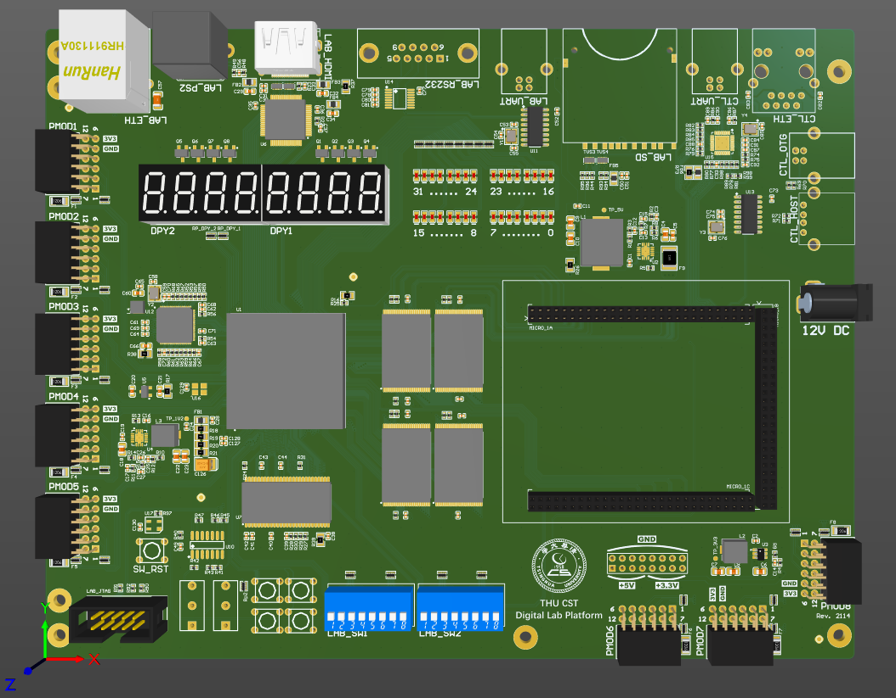
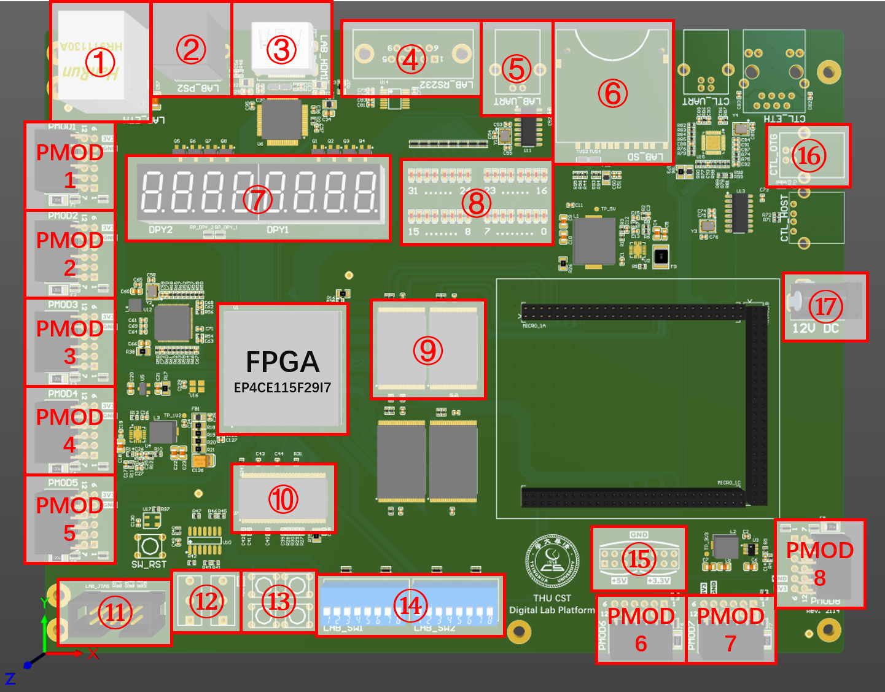

# 实验板（Intel FPGA 版）

## 实验板外观

!!! warning "了解硬件"

    在开始进行你的实验之前，请务必仔细阅读本章，了解实验板各组件的功能，防止错误的硬件连接损坏实验板。

《数字逻辑设计》课程所用的实验板（Intel FPGA 版）外观如图：



实验时可能用到的组件标号如下图，具体描述及功能请阅读下一节了解。



## 各组件说明

图片中使用红圈标注的组件描述如下：

1. 千兆 RJ45 以太网接口：使用 RTL8211 PHY 芯片，通过 GMII 总线与 FPGA 相连；
2. PS/2 键盘、鼠标接口；
3. HDMI 视频接口：最高支持 1080P 24 位色，使用 VGA 时序，样例代码请参考工程模板；
4. RS-232 串口：可连接使用 RS-232 电平的串口外设；
5. USB 转 TTL 串口：连接电脑可用于 FPGA 的调试输出；
6. SD 卡座：建议使用小容量低速 SD 卡，并通过 SPI 协议访问；按照标准，除了 SDUC 以外，其他的 SD 卡都应该支持 SPI 协议，但一些 SD 卡型号违背了标准，不支持 SPI 协议，见 [来源 1](https://forum.4dsystems.com.au/node/1869) 和 [来源 2](https://github.com/MarlinFirmware/Marlin/issues/2082#issuecomment-102381964)；
7. 8 位扫描式数码管：使用方法请参考工程模板；
8. 32 位 LED 灯：用于调试，输出高电平时点亮；
9. 4MB SRAM 内存：32 位宽，理论延迟为 10ns，是两片型号为 [IS61WV102416BLL-10TLI](https://www.issi.com/WW/pdf/61WV102416ALL.pdf) 各 2MB 的 SRAM 数据线并联而成（两组 SRAM 连接同样的 `addr` `ce_n` `we_n` `oe_n` 信号，两组 `data` 拼接成为 32 位，两对 `ub_n` `lb_n` 组合成了 4 位的 `be_n`）；
10. 32MB SDRAM 内存：16 位宽，需要使用专用的控制器模块；
11. FPGA JTAG 调试接口：用于连接 USB Blaster 下载程序；
12. 2 个带去抖按键：自带硬件去抖电路，按下时为高电平；
13. 4 个普通按键：不带去抖电路，按下时为低电平；
14. 16 位拨码开关：拨上时为低电平；
15. 电源输出接口：可用于给外设模块供电，支持 5V 和 3.3V 两种电压；
16. USB 控制接口：连接电脑，可用于读写 SRAM 内存；
17. 电源输入接口：**只允许** 连接提供的 12V 直流电源，用于给实验板供电。

另外，我们还提供了 8 个 Pmod 扩展接口，可连接兼容 Pmod 标准的外设模块，或使用杜邦线连接其他外设模块。具体使用方法参见 [常见外设](peripheral.md) 章节。

FPGA 型号是 [EP4CE115F29I7](https://www.intel.com/content/www/us/en/products/sku/210467/cyclone-iv-ep4ce115-fpga/specifications.html)，内置资源有：

- Logic Elements: 114000
- M9K Memory Blocks: 432
- Embedded Memory: 3.888 Mb
- DSP Blocks(18x18 multipliers): 266
- PLL: 4


## 控制模块使用方法

实验板上提供了用于读写 SRAM 内存的控制器模块，通过 USB 接口与电脑连接。使用时，先将开发板上电，等待约 20s 后，数码管将会显示为 "00000000"，此时控制器已经启动完成。

将 USB 与板上的 USB 控制接口（图中 16 号）相连，开发板将会虚拟成为一个以太网卡。计算机通常会自动从该网卡使用 DHCP 获取 IP，获取到 IP 后，在 Chrome 或 Firefox 等现代浏览器中打开 http://192.168.9.9/ 即可访问实验板控制面板。需要注意的是部分 macOS 系统无法使用。

### SRAM 读写操作

实验板控制面板的主要功能为对板载的 4MB SRAM 进行读写操作。在面板上输入读写起始地址，选择电脑上的二进制文件，即可向 SRAM 中写入数据；输入起始地址和长度，即可从 SRAM 中读取数据，并显示在网页上，或下载为二进制文件。

读写起始地址均要求为十六进制，且地址和长度均须为 4 的整数倍数，即至少要完整写入或读出 SRAM 的一个 32 位字。

!!! danger "注意格式"

    该 SRAM 读写工具与 Quartus 的片内 ROM 初始化工具不同，使用的不是 Mif 文件，而是原始的二进制文件。二进制文件中的每个字节，将会被原样写入 SRAM 中的对应位置中。因此，如果要写入一张图片等数据，请自行编写程序，按照需求生成二进制图片文件。

!!! note "注意端序"

    该工具读写内存使用的是小端序，同时使用的地址单位为字节，而非 SRAM 的 32 位字。即 SRAM 每个地址读出的 32 位数据中，最低 8 位为写入的二进制文件靠前的字节，最高 8 位为写入的二进制文件靠后的字节，以此类推。

## macOS 用户

如果你使用 macOS，由于 Quartus 不支持 macOS，需要在虚拟机或者远程 Linux 环境下运行 Quartus，用 VSCode Remote 进行远程开发。生成 Bitstream .sof 文件后，可以转换为 .rbf 格式，复制到本地，再用 openFPGALoader 下载：

```shell
# in macOS
$ brew install openfpgaloader
$ openFPGALoader -c usb-blaster --detect
index 0:
        idcode 0x20f70dd
        manufacturer altera
        family cyclone IV
        model  EP4CE115
        irlength 10
# in Linux
$ quartus_cpf --option=bitstream_compression=off -c digital-design.sof digital-design.rbf
# in macOS
$ scp linux:/path/to/digital-design.rbf .
$ openFPGALoader -c usb-blaster --fpga-part ep4ce115 digital-design.rbf
```

此外，部分 macOS 系统无法连接到控制模块，可以使用 USB 直通到 Linux 虚拟机的方法。
