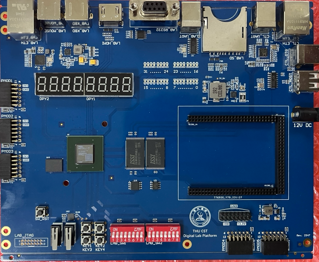
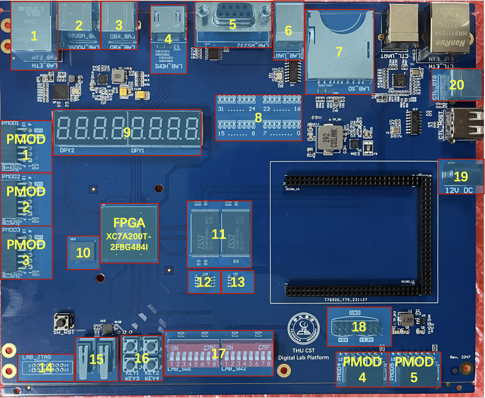
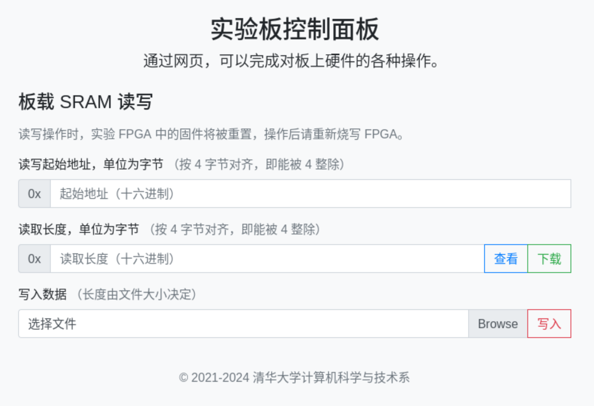

# 实验板（Xilinx FPGA 版）

## 实验板外观

!!! warning "了解硬件"

    在开始进行你的实验之前，请务必仔细阅读本章，了解实验板各组件的功能，防止错误的硬件连接损坏实验板。

《数字逻辑设计》课程所用的实验板（Xilinx FPGA 版）外观如图：



实验时可能用到的组件标号如下图，具体描述及功能请阅读下一节了解。



## 各组件说明

图片中标注的组件描述如下：

1. 千兆 RJ45 以太网接口（LAB\_ETH）：使用 RTL8211 PHY 芯片，通过 RGMII 总线与 FPGA 相连；
2. PS/2 鼠标接口（LAB\_MOUSE）；
3. PS/2 键盘接口（LAB\_KBD）；
4. HDMI 视频接口（LAB\_HDMI）：最高支持 1080P 24 位色，样例代码请参考工程模板；
5. RS-232 串口（LAB\_RS232）：可连接使用 RS-232 电平的串口外设；
6. USB 转 TTL 串口（LAB\_UART）：连接电脑可用于 FPGA 的调试输出；
7. SD 卡座（LAB\_SD）：建议使用小容量低速 SD 卡，并通过 SPI 协议访问；按照标准，除了 SDUC 以外，其他的 SD 卡都应该支持 SPI 协议，但一些 SD 卡型号违背了标准，不支持 SPI 协议，见 [来源 1](https://forum.4dsystems.com.au/node/1869) 和 [来源 2](https://github.com/MarlinFirmware/Marlin/issues/2082#issuecomment-102381964)；
8. 32 位 LED 灯：用于调试，使用方法请参考工程模板；
9. 8 位扫描式数码管（DPY1-2）：使用方法请参考工程模板；
10. 512MB DDR3-1866 SDRAM 内存：512 Mb x 8，型号为 [MT41K512M8RH-107IT](https://media-www.micron.com/-/media/client/global/documents/products/data-sheet/dram/ddr3/4gb_automotive_ddr3l.pdf)；
11. 4MB（并行）SRAM 内存：32 位宽，理论延迟为 10ns，是两片型号为 [IS61WV102416BLL-10TLI](https://www.issi.com/WW/pdf/61WV102416ALL.pdf) 各 2MB 的 SRAM 数据线并联而成（两组 SRAM 连接同样的 `addr` `ce_n` `we_n` `oe_n` 信号，两组 `data` 拼接成为 32 位，两对 `ub_n` `lb_n` 组合成了 4 位的 `be_n`）；
12. 16MB SPI NOR Flash：型号为 [W25Q128JVSIQTR](https://www.winbond.com/hq/product/code-storage-flash-memory/serial-nor-flash/?__locale=en&partNo=W25Q128JV)；
13. 8MB SPI SRAM 内存：型号为 [VTI7064](https://www.lcsc.com/datasheet/lcsc_datasheet_1811151432_Vilsion-Tech-VTI7064MSME_C139966.pdf)；
14. FPGA JTAG 调试接口（LAB\_JTAG）：用于连接 Xilinx 下载器下载程序；
15. 2 个带去抖按键（CLK、RST）：自带硬件去抖电路，按下时为高电平；
16. 4 个带去抖按键（KEY1-4）：自带硬件去抖电路，按下时为高电平；
17. 16 位拨码开关（LAB_SW1-2）：拨上时为低电平；
18. 电源输出接口：可用于给外设模块供电，支持 5V 和 3.3V 两种电压；
19. 电源输入接口：**只允许** 连接提供的 12V 直流电源，用于给实验板供电。
20. USB 控制接口（CTL\_OTG）：连接电脑，可用于读写 SRAM 内存；

另外，我们还提供了 5 个 Pmod 扩展接口，可连接兼容 Pmod 标准的外设模块，或使用杜邦线连接其他外设模块。具体使用方法参见 [常见外设](peripheral.md) 章节。

FPGA 型号是 [XC7A200T-2FBG484I](https://docs.amd.com/v/u/en-US/7-series-product-selection-guide)，内置资源有：

- Logic Cells: 215360
- Total Block RAM: 13140 Kb
- DSP Slices: 740
- PLL: 10

## 控制模块使用方法

实验板上提供了用于读写 SRAM 内存的控制器模块，通过 USB 接口与电脑连接。使用时，先将开发板上电，等待 30-50s 后，数码管将会显示为 "00000000"，此时控制模块已经启动完成。在控制模块启动完成之前，不建议烧写 bitstream 到 FPGA，否则烧写的内容可能会被控制模块覆盖。

将 USB 与板上的 USB 控制接口（图中 20 号，CTL_OTG）相连，开发板将会虚拟成为一个以太网卡。计算机通常会自动从该网卡使用 DHCP 获取 IP，获取到 IP 后，在 Chrome 或 Firefox 等现代浏览器中打开 http://192.168.9.9/ （注意不是 https）即可访问实验板控制面板。

需要注意的是，部分 macOS 系统连到控制模块后，看不到虚拟的以太网卡。此时可以起 Linux 虚拟机，把 USB 设备直通到虚拟机中，然后在虚拟机里访问控制模块。

如果发现控制模块一直启动失败，可以确认一下控制模块上的拨码（显示 ON、1 和 2）的位置，1 对应的拨码应当在 1 这一侧，2 对应的拨码应当在 ON 这一侧（对应 MIO5=1，MIO4=0，SPI 模式）。如果拨码正确，复位后还是不工作，请联系助教。

注意控制模块也有自己的 JTAG 插座，和实验 FPGA 的 JTAG 插座的外型一样的，只是位置不同。如果错误地插到控制模块的 JTAG 上，Vivado 将会看到 xc7z020 的 FPGA，而不是正确的 xc7a200t。

### SRAM 读写操作

实验板控制面板的主要功能为对板载的 4MB SRAM 进行读写操作。在面板上输入读写起始地址，选择电脑上的二进制文件，即可向 SRAM 中写入数据；输入起始地址和长度，即可从 SRAM 中读取数据，并显示在网页上，或下载为二进制文件。需要注意的是，读写 SRAM 时，为了避免出现冲突，实验 FPGA 会“复位”到数码管显示 "00000000"的状态。之后如果想要运行自己的设计，需要重新下载 Bitstream。



读写起始地址均要求为十六进制，且地址和长度均须为 4 的整数倍数，即至少要完整写入或读出 SRAM 的一个 32 位字。

!!! danger "注意格式"

    该 SRAM 读写工具与 Vivado 的片内 ROM 初始化工具不同，使用的不是 COE 文件，而是原始的二进制文件。二进制文件中的每个字节，将会被原样写入 SRAM 中的对应位置中。因此，如果要写入一张图片等数据，请自行编写程序，按照需求生成二进制图片文件。

!!! note "注意端序"

    该工具读写内存使用的是小端序，同时使用的地址单位为字节，而非 SRAM 的 32 位字。即 SRAM 每个地址读出的 32 位数据中，最低 8 位为写入的二进制文件靠前的字节，最高 8 位为写入的二进制文件靠后的字节，以此类推。


## macOS 用户

如果你使用 macOS，由于 Vivado 不支持 macOS，需要在虚拟机或者远程 Linux 环境下运行 Vivado，用 VSCode Remote 进行远程开发。生成 Bitstream .bit 文件后（路径为项目目录下的 `project-template-xilinx.runs/impl_1/mod_top.bit`），复制到本地，再用 openFPGALoader 下载：

```shell
# in macOS
$ brew install openfpgaloader
$ openFPGALoader -c ft2232 --detect
empty
Jtag frequency : requested 6.00MHz   -> real 6.00MHz
index 0:
        idcode 0x3636093
        manufacturer xilinx
        family artix a7 200t
        model  xc7a200
        irlength 6
$ scp linux:/path/to/mod_top.bit .
$ openFPGALoader -c ft2232 --fpga-part xc7a200t mod_top.bit
```

另一种办法是，在 macOS 上运行 jtag-remote-server，通过 xvc 协议暴露出 FPGA 的 JTAG 接口，通过网络转发到 Linux 机器上，再让 Vivado 通过 xvc 连接 FPGA。这样的好处是 ILA 等功能也可以正常使用，缺点是受网络延迟和带宽影响比较大。

更进一步，还可以在虚拟机内启动 Linux，在 Linux 虚拟机内启动 Xilinx Vivado 的 `hw_server` 程序，把下载器的 USB 设备直通到 Linux 虚拟机中，然后再设法把 `hw_server` 监听的 3121 端口转发到实际运行 Vivado 的 Linux 系统上，就可以获得比较好的 Vivado 使用体验。

此外，部分 macOS 系统无法连接到控制模块，可以使用 USB 直通到 Linux 虚拟机的方法。


## 与 Intel FPGA 版实验板的区别

Xilinx FPGA 版实验板是 2023 年新设计的数字逻辑设计实验开发板，相比上一个 Intel FPGA 版实验板，做出了如下的改变：

1. FPGA 从 Intel 的 EP4CE115F29I7 换为 Xilinx 的 XC7A200T-2FBG484I，新旧 FPGA 对比，制程从 60nm 提升到 28nm，同时逻辑单元数量提升到 2 倍，内置的 Block RAM 容量提升到 3 倍，可以给同学的设计留下更充足的空间；
2. 将 32MB SDR SDRAM 内存升级到 512MB DDR3 SDRAM 内存，在速度和容量上获得了巨大的提升；
3. 把 PS/2 接口扩展到两个，不再需要鼠标键盘二选一，可以全都要；
4. 由于引脚个数限制，减少了 PMOD 扩展接口的个数：从 8 减少到 5，不过不用担心，根据往年的经验，5 个也是用不完的；
5. 由于引脚个数限制，减少了一组 SRAM，只剩下了一组（并行）SRAM（实际上 Intel FPGA 版实验板也只焊接了一组），不过作为补偿，添加了 16MB 的 SPI NOR Flash 和 8MB 串行 SPI SRAM 内存。

备注：XC7A200T 是 Xilinx Artix 7 系列里最高端的一款 FPGA。Xilinx(AMD) FPGA 一共有这些产品系列：

1. Spartan-6:45nm
2. 7 Series：28nm，从低端到高端依次是 Spartan 7，Artix 7，Kintex 7，Virtex 7
3. UltraScale：20nm，从低端到高端依次是 Kintex UltraScale，Virtex UltraScale
4. UltraScale+：16nm，从低端到高端依次是 Spartan UltraScale+，Artix UltraScale+，Kintex UltraScale+，Virtex UltraScale+

此外，Xilinx(AMD) 还有系列 SoC 产品，它在 FPGA 旁边还加入了 ARM 处理器核心，有这些产品系列：

1. Zynq 7000：对应 7 Series，28nm
2. Zynq UltraScale+ MPSoC/RFSoC：对应 UltraScale+，16nm
3. Versal: 7nm