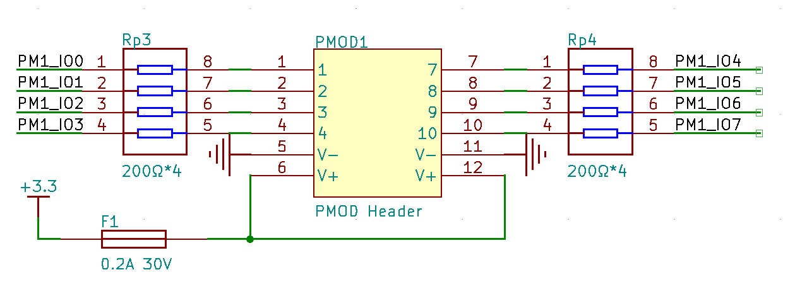

# 外接外设

## 常见接口或协议

!!! warning "小心损坏"

    注意：下面的各类接口只负责数据的传输，一般外设模块都另外需要连接电源（VCC）、接地（GND）引脚。
    **千万注意选择正确的电平/电压（一般为 CMOS 电平，注意 FPGA 只能连接 3.3V IO 电平的模块），并且避免短路、插反，不允许带电插拔，避免损坏芯片或 FPGA。**

关于 UART/SPI/I2C 三种接口的介绍视频（搬运自 [YouTube](https://www.youtube.com/watch?v=IyGwvGzrqp8)）：[Bilibili](https://www.bilibili.com/video/BV1D7411m7gh?from=search&seid=17456041608147636146)。 

### Pmod 规范

Pmod（Peripheral Module Interface）是 Digilent 提出的，适用于各类开发板的接口扩展规范。它定义了引脚的物理外观、电气特性、接口定义等，能够兼容各类协议。遵循 PMOD 规范的外设能够互相兼容，减少了外设的复杂性。相关介绍可见：

* 博客介绍：<http://xilinx.eetrend.com/d6-xilinx/article/2018-05/12915.html>
* 接口规范：<https://reference.digilentinc.com/_media/reference/pmod/digilent-pmod-interface-specification.pdf>

各种常用的通信协议都被 Pmod 标准所支持，当然用户也可以自行规定引脚含义。实验板上共提供了 8 个标准 12 Pin Pmod 接口，用于连接外设模块，其供电电压与 IO 电平均为 3.3V。同时，相邻的 Pmod 接口可以用于连接宽体的模块，以提供更多 IO 信号。

在项目模板的 `io.tcl` 中定义了各个 Pmod 接口的引脚约束，其中 `pmod_io[0]` 到 `pmod_io[3]` 对应 Pmod 接口的 1-4 引脚，`pmod_io[4]` 到 `pmod_io[7]` 对应 Pmod 接口的 7-10 引脚，如上图。板子上的引脚旁标记了引脚编号，上面一排是 1-6，下面一排是 7-12。

### UART 协议

通用非同步收发传输器（Universal Asynchronous Receiver/Transmitter），又称为“串口”，一般有两个引脚（`RX`、`TX`）。每个引脚负责一个方向，两个方向异步发送，传送时不包含时钟，速率需要事先协定好（称为波特率/Baud）。可参考实现：

* <https://github.com/z4yx/thinpad_top/blob/rev.3/thinpad_top.srcs/sources_1/new/async.v>
* <https://www.fpga4fun.com/SerialInterface.html>

### I²C 协议

I²C（Inter-Integrated Circuit），同步协议，一般有两个引脚：数据（SDA）、时钟（SCL），每个引脚都是双向的，在 FPGA 中需要使用特别的 **三态数据类型**（`inout`）。

按照规范，两根数据线均需要上拉电阻，可按照 [此教程](https://electronics.stackexchange.com/questions/248248/altera-fpga-i-o-weak-pull-ups) 开启 FPGA 片内相应引脚的上拉电阻。

一般来说，由发送方提供时钟，接收方需要在每次接受数据后进行应答。可参考 <https://www.fpga4fun.com/I2C.html>。

### I²S 协议

I²S（Inter-Integrated Sound），一般用于数字音频传输，包含时钟（`SCLK/BCLK`）、帧使用（`LRCK/WS`）、数据（`SDATA`）。适合需要自定义音频的场合。如果只需要播放背景音乐等固定的音乐，建议直接购买 MP3 语音模块。

### SPI 协议

SPI（Serial Peripheral Interface），同步协议，一般有四个引脚：时钟（`SCK`）、`MOSI`、`MISO`、片选（`SSEL/CS`）。

两个方向可全双工发送。由 master 端确定时钟速率。可参考 <https://www.fpga4fun.com/SPI.html>。

### 脉冲接口

最简单的接口，直接输出或输入脉冲信号（由高低电平变化表示）。如超声波模块中，使用一个信号线控制超声波的发射，经过一段时间后，另一个引脚会收到返回的脉冲。或者类轨迹球模块中，可计数一段时间内的脉冲个数，表示向某个方向移动的距离。

### 类 SRAM 接口

类似于 SRAM 或者内置 ROM IP 等的使用方法，可以是同步或者异步接口。包括（可选）时钟（`CLK`）、片选（`CE`）、读使能（`RE`）、写使能（`WE`）、地址、数据。

## 模块推荐

!!! warning "注意电平"

    以下的模块为我们推荐的型号，但选择时 **并未确认模块的供电电压和 IO 电平**，购买和使用前请务必查看手册或向店家确认 IO 电平为 3.3V，以免损坏实验板。

实验板对外可提供 **5V/3.3V** 的供电电源，如果模块需要其他电压的电源，需要自行购买 DCDC 模块以转换电源电压。

如果需要同时连接多个模块，建议购买 **面包板**，并自学其使用/回忆电子学实验内容，方便公用电源、地线。

选购之前请务必对所选的模块有 **完整的了解**，包括其功能、接口、通讯协议等，使用前必须 **通读整篇文档或 datasheet**！

### Pmod 模块

下面列出的模块适用于实验板的 Pmod 接口。如需其他模块，也可先在各类电商平台搜索，实验板可以支持几乎所有 Pmod 模块。

| 功能          | 型号                       | 协议           | 简介                                                           | 购买链接                                                                                                                                                  |
|---------------|----------------------------|----------------|----------------------------------------------------------------|-----------------------------------------------------------------------------------------------------------------------------------------------------------|
| 音频输入/输出 | WM8731                     | I2S            | 音频输入/输出模块                                              | 自制模块，请联系助教团队获取（[原理图](https://github.com/jiegec/WM8731PMOD) [样例代码](https://github.com/jiegec/Arty-A7-WM8731PMOD)）                                                                                                                               |
| 音频输入/输出 | MES-Linein-MIC/MES-Speaker | I2S            | 音频输入/输出模块                                              | https://item.taobao.com/item.htm?id=762086873533                                                                                                          |
| 音频输入/输出 | PSI-PMOD-AUDIO-001         | AC97           | 音频输入/输出模块                                              | https://item.taobao.com/item.htm?id=616327384190                                                                                                          |
| 音频输出      | PMOD-AUDIO                 | I2S            | 音频输出模块                                                   | https://item.taobao.com/item.htm?id=617206846401                                                                                                          |
| NOR Flash     | PMOD-SPI-NOR-FLASH         | SPI            | 16MB NOR Flash，可以用来存储数据                                | 自制模块，请联系助教团队获取                                                                                                                               |
| 无线通信      | PSI-EMOD-BLUETOOTH         | UART           | 蓝牙串口传输模块，可与手机连接传输数据                          | https://item.taobao.com/item.htm?id=602102213182 （已下架）                                                                                                 |
| 无线通信      | PmodBT2                    | UART           | 蓝牙串口传输模块                                               | https://www.mouser.cn/ProductDetail/Digilent/410-214?qs=s%2FdyVPQMB4z05kZmem7h5Q%3D%3D                                                                    |
| 温度传感器    | PSI-EMOD-SENSOR-001        | 1-Wire         | 基于 DS18B20 的温度传感器模块                                  | https://item.taobao.com/item.htm?id=616627001082 （已下架）                                                                                                 |
| EEPROM 存储器 | PSI-EMOD-MEMORY-001        | I2C            | 2K 字节 EEPROM 存储器，可方便地存储少量持久化数据               | https://item.taobao.com/item.htm?id=617136619926                                                                                                          |
| 摄像头        | PSI-EMOD-OV7670            | 并行           | OV7670 摄像头模组，较低分辨率（30 万像素，640x480），适合 FPGA 使用 | https://item.taobao.com/item.htm?id=625385869412 （已下架）                                                                                                 |
| 摄像头        | PMOD_CAM_5M                | 并行           | OV5640 摄像头模组，500 万像素（2592x1944）                        | https://item.taobao.com/item.htm?id=524514493918（已下架）                                                                                                  |
| 摄像头        | PMOD-CAMERA                | 并行           | OV2640 摄像头模组，200 万像素（1622x1200）                        | https://item.taobao.com/item.htm?id=710247485191                                                                                                          |
| 颜色传感器    | PMOD COLOR MODULE TCS3472  | I2C            | TCS3472 颜色传感器                                             | https://item.taobao.com/item.htm?id=712469416493#detail（已下架）  https://www.mouser.cn/ProductDetail/Digilent/410-348?qs=f9yNj16SXrJeCy%252BYmMCoTQ%3D%3D |
| 旋钮          | PMOD ENC ROTARY ENCODER    | Rotary Encoder | N/A                                                            | https://www.digikey.cn/en/products/detail/digilent-inc/410-117/4090075                                                                                    |

此外，可以前往以下店铺，尝试发现更多 Pmod 模块，注意其中部分模块的功能实验板已经内置，请勿重复购买。

1. [PSI 皮赛电子](https://pisai.taobao.com/category-1731295189.htm)
2. [Muse Lab](https://shop446922193.taobao.com/category-1573912201.htm)
3. [迪芝伦](https://digilent.taobao.com/category-1636623609.htm)（模块种类极为丰富，但价格昂贵，购买前请尽量寻找替代方案，或使用学术优惠价格）
4. [迪芝伦国际站](https://digilent.com/shop/boards-and-components/system-board-expansion-modules/)（在模块页面下面找中国经销商购买，价格昂贵）

一些 PMOD 模块在 PCB 上标明了引脚的信号名称。如果没有的话，可以询问商家获取文档，找到其中的原理图，根据原理图就可以知道 PMOD 各个引脚对应的信号名称。

### 传感器类

下面的模块需要使用杜邦线，手工连接到实验板的 GPIO 接口上。

| 功能            | 型号      | 接口 | 简介                                             | 购买链接                                                                |
|---------------|-----------|------|------------------------------------------------|-------------------------------------------------------------------------|
| 运动、姿态传感器 | [JY901S](https://wit-motion.yuque.com/wumwnr/docs/khbgzd?singleDoc#%20%E3%80%8AJY901S%E4%BA%A7%E5%93%81%E8%B5%84%E6%96%99%E3%80%8B)    | UART | 三轴向加速度、陀螺仪、角度、绝对方向传感器，自带滤波 | https://item.taobao.com/item.htm?id=634627673077 购买时联系卖家焊好排针 |
| 激光测距        | [VL53L0X](https://www.st.com/resource/en/datasheet/vl53l0x.pdf)   | I2C  | 激光 ToF 测距，量程 3~200cm，精度 3%，测量时间 20ms | https://detail.tmall.com/item.htm?id=609293677802                       |
| 超声测距        | ——        | 脉冲 | 精度较低，量程大，可根据需求选择型号               | https://detail.tmall.com/item.htm?id=12632417946                        |
| 手势传感        | [PAJ7620U2](https://www.waveshare.com/w/upload/1/15/PAJ7620U2_GDS-R1.0_29032016_41002AEN.pdf) | I2C  | 可识别上下左右挥动、顺时针、逆时针旋转等手势       | https://detail.tmall.com/item.htm?id=569499698342&skuId=4401524435517   |

### 模拟接口类

下面列出一些常用的模拟接口，主要为音频输入、输出相关模块。

| 功能     | 型号       | 接口 | 简介                                                            | 购买链接                                                                 |
|--------|------------|------|---------------------------------------------------------------|--------------------------------------------------------------------------|
| 蜂鸣器   | ——         | ——   | 无源蜂鸣器，可以直接用 FPGA IO 引脚播放简单的频率，产生音乐       | https://item.taobao.com/item.htm?id=12773366240                          |
| 音频播放 | VS1053B    | SPI  | 自带 TF 卡槽，可以由 SPI 控制，播放其中的 mp3 音乐，或录制一段音频 | https://detail.tmall.com/item.htm?id=604374710689                        |
| 音频播放 | MP3-TF-16P | UART | 自带 TF 卡槽，由串口控制播放音乐                                 | https://item.taobao.com/item.htm?id=555798813610                         |
| 小喇叭   | ——         | ——   | 配合上面的音频播放模块一起购买                                  | https://item.taobao.com/item.htm?id=542182665254 联系卖家，接口改成杜邦线 |

### 无线通信

汇承 HC-12 433MHz 无线通讯（UART 串口透明传输，可理解为无线的串口线）。 **必须成对购买**，两端直接连接到 UART 接口，不需要其他硬件：<https://detail.tmall.com/item.htm?id=41299178593>。

非板子的一侧，需要准备一个充电宝供电，并购买 <https://detail.tmall.com/item.htm?id=43037505556> 等类似模块，方便连线。

## 调试方法

可以购买模块供 PC 调试相应的协议使用（强烈建议购买外设时搭配购买，能极大地方便调试工作）：

* CP2102 模块（UART 串口转 USB）：<https://detail.tmall.com/item.htm?id=41337916197&skuId=4141815325445>
* 逻辑分析仪（类似示波器，可解码任何数字协议，但不能发送数据）：<https://item.taobao.com/item.htm?id=587348570376> （已下架）

如果有不同接口调试需要，建议另行购买单片机（如 Arduino）进行。在使用中如果遇到问题，建议使用 SignalTap/逻辑分析仪采集信号进行观察。

## 注意事项

1. 购买任何物品记得开发票（除非不需要报销）。发票抬头：清华大学，税号：12100000400000624D。
2. 购买模块时，记得让店家帮忙 **焊好排针**。自己选择模块时，要注意选择 2.54mm 间距排针/排母接口的，或者同时向店家询问，购买将模块接口转换成杜邦线的转接线，以免无法连接。
3. 购买足够的杜邦线，在长度和数量上留出裕量，反正也很便宜。注意不要买错极性（即公母），以及间距（2.54mm），建议直接购买大量母 - 母、公 - 公线缆，确保足够。
4. 使用任何芯片前，仔细阅读附带的文档（datasheet），尤其是时序图相关部分。寻找文档时， **优先使用 Google，寻找相应主芯片的英文手册**。建议有条件的先行使用 PC 进行调试，确保芯片功能完好并掌握时序后，再上板使用。一些可能需要的工具模块已经在上面列出。推荐使用“串口助手”等软件进行辅助调试，也可用 Python 等语言的相关第三方库进行，可自行搜索。
5. 芯片需要的 VCC、GND 一般可以直接从实验板获得。如果带不动（比如表现诡异或者无响应，尤其是音频播放模块较为耗电），则需要额外供电，请一定联系助教确认。
6. 如果对于自己选择的模块、连线方式有疑问，请务必在购买前 **联系店家或助教确认**，以免耽误开发时间。

## FAQ

这里会记录同学们的常见问题，和助教的回答。

!!! question "杜邦线是否可以接得很长？"

    可以，但是要注意以下几点：线路上的电流不能过大（如音频模块的电源、地线），信号频率不能过高（建议低于 1MHz），需要妥善保护连接处避免线路中断。如果需要很长的线缆，建议直接购买长杜邦线，或考虑使用无线传输。

!!! question "使用充电宝对无线传输的模块供电，需要注意的事情？"

    充电宝通常输出电压均为 5V，需要检查被供电的所有模块的电压范围，如果均可以接受 5V 供电，可以直接购买 USB 公头转杜邦线的模块进行供电，否则需要购买 USB 接口的稳压模块等，以转换电源电压。这些模块推荐到淘宝 Telesky 旗舰店选购。
