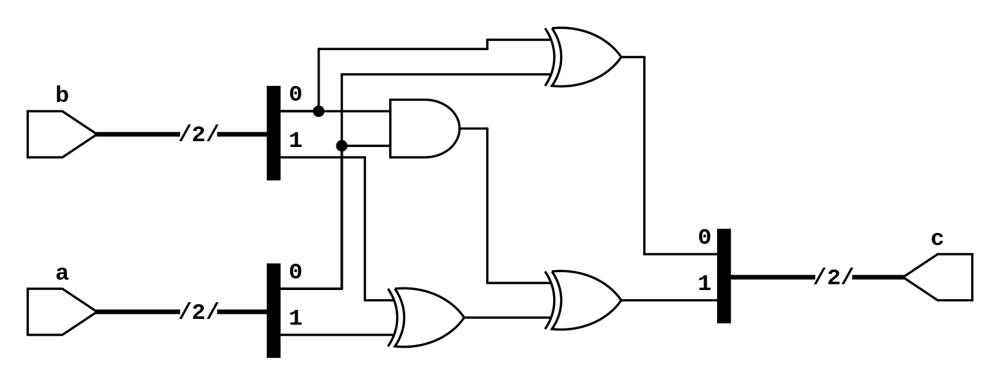

# 加法器


## 需求

让我们来实现一个 2 位加法器：即输入两个非负整数，输出这两个数的和。要求只要输入变化，输出就随之变化。

根据上面的需求，可以设计如下的输入输出信号：

输入：

1. `a`: 宽度为 2，表示输入的第一个非负整数
2. `b`: 宽度为 2，表示输入的第二个非负整数

输出：

1. `c`: 宽度为 2，表示 `a+b`，溢出的部分舍弃

## 波形

根据上面的需求，既然输出 `c` 信号是随着输入信号变化而变化，我们就可以画出下面的波形：

<script type="WaveDrom">
{
  signal:
    [
      { name: "a", wave: "==.===.=..==", data: ["1","3","0","2","3","0","2","1"]},
      { name: "b", wave: "=..=..==..=.", data: ["3","2","1","0","3"]},
      { name: "c", wave: "==.=====..==", data: ["0","2","2","0","1","0","0","1","0"]}
    ]
}
</script>

可以看到，`a` 和 `b` 可以随时变化，而 `c` 也会立即更新为求和以后的结果。


## 电路

对于这一类 **输出仅随着输入变化而变化** 的信号，我们通常使用 **组合逻辑** 来实现。它的特点是输出完全依赖于输入，没有内部状态，和时间无关。

根据真值表，可以得到输出与输入的关系（`a_0` 表示 `a` 的最低位）：

- $c_0=a_0 ^ b_0$ 最低位异或
- $c_1=(a_1 ^ b_1) ^ (a_0 & b_0)$ 第 1 位异或再加进位

电路图如下：



## 代码

最后再用 HDL 来实现如上的功能。虽然上面我们推导了加法的逻辑电路，但实际上写 HDL 的时候，我们直接写 `a+b` 就可以了，EDA 工具会自动完成逻辑的转换。

### VHDL

首先，根据前面确定的输出信号编写 `entity`：

```vhdl
library IEEE;
use IEEE.STD_LOGIC_1164.ALL;
use IEEE.STD_LOGIC_UNSIGNED.ALL;

entity add2 is
    Port ( a : in  STD_LOGIC_VECTOR (1 downto 0);
           b : in  STD_LOGIC_VECTOR (1 downto 0);
           c : out STD_LOGIC_VECTOR (1 downto 0));
end add2;
```

通常，当我们声明一个宽度为 `n` 的信号的时候，采用的是 `STD_LOGIC_VECTOR (n-1 downto 0)` 的写法，可以理解为一共有 `n` 位，下标从高到底是 `n-1` 到 `0`。其余部分是什么作用，不用管，当成模板记住就行。

接着，我们要把电路实现放在 `architecture` 内部。对于组合电路，直接构造 `a+b` 的电路，然后把结果 **连接** 到输出信号 `c` 即可。


```vhdl
architecture behavior of add2 is
begin
  c <= a + b;
end behavior;
```

请注意，不要把这里的 `<=` 理解为赋值，而是把它看成信号的连接：通过一系列的逻辑门（比如上面提到的异或门 XOR、与门 AND），计算得到 `a+b` 的结果，再把结果连接到输出信号 `c` 上。

### Verilog/System Verilog

首先，根据前面确定的输出输出信号编写 `module`：

```verilog
module add2 (
  input [1:0] a,
  input [1:0] b,
  output [1:0] c
);
  // TODO
endmodule
```

通常，当我们声明一个宽度为 `n` 的信号的时候，采用的是 `[n-1:0]` 的写法，可以理解为一共有 `n` 位，下标从高到底是 `n-1` 到 `0`。其余部分是什么作用，不用管，当成模板记住就行。这里有一个很容易犯的错误是在 `output [1:0] c` 后面多写了一个逗号，通常是在复制粘贴的时候忘记删除。

接着，我们要把电路实现放在 `module` 内部。对于组合电路，直接构造 `a+b` 的电路，然后把结果 **连接** 到输出信号 `c` 即可。


```verilog
  assign c = a + b;
```

请注意，不要把这里的 `assign c = a + b` 理解为赋值，而是把它看成信号的连接：通过一系列的逻辑门（比如上面提到的异或门 XOR、与门 AND），计算得到 `a+b` 的结果，再把结果连接到输出信号 `c` 上。

## 总结

回顾上面的电路，可以看到它最大的特点是 **输入一变化，输出就跟着变**，并且与时间无关，只要给定了输入，那么它的输出就是确定的（类比数学上的函数 `output = f(input)`），这种电路我们称之为 **组合电路**。

为了在硬件上搭建一个组合电路，在 VHDL 中，我们直接对输入信号进行一系列的计算（`a+b`），把结果通过 `output <= a+b;` 语句 **连接** 到了输出信号；在 Verilog 中，我们同样对输入信号进行了计算（`a+b`），把结果通过 `assign output = a+b;` 语句 **连接** 到了输出信号。

!!! question "组合逻辑很复杂怎么办，比如 `if-then-else` 的逻辑？"

    看到这里你可能会有一个疑问，如果这个计算过程很复杂怎么办？按照目前的代码编写方式，我们只能把 `if (a) then b else c` 改写成 `a ? b : c`，但是逻辑更加复杂以后，代码可读性会急剧下降，例如 `a ? (b ? c : d) : (e ? f : g)`。之后我们会介绍如何在代码中实现更复杂的组合逻辑。