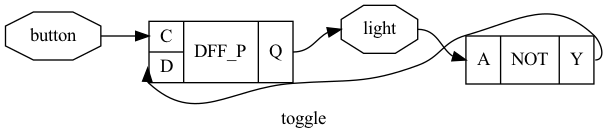

# 按钮开关

## 需求

让我们来实现一个控制台灯的按钮开关：按下开关的时候，灯会亮起来；再次按下开关的时候，灯就熄灭了。

根据上面的需求，可以设计如下的输入输出信号：

输入：

1. `button`：1 表示按钮被按下，0 表示按钮处于弹起的状态

输出：

1. `light`：1 表示灯亮起，0 表示灯熄灭

## 波形

分析上面的需求，可以发现，此时不再满足我们刚刚学到的 **组合逻辑** 的特点，虽然输出（`light`）也是随着输入信号变化而变化，但是第一次按的时候输出 `1`，第二次按的时候输出了 `0`，说明输出不仅随着输入变化而变化。

仔细一想，我们可以发现一个规律：按钮被按下的时候，灯会从亮起到熄灭，或者从熄灭到亮起，说明输出的值是之前输出的值取反。而按钮按下（从 `0` 变成 `1`）是用来触发取反的动作。

根据分析，可以得到下面的波形：

<script type="WaveDrom">
{
  signal:
    [
      { name: "button", wave: "0.1.0.1.0..1"},
      { name: "light", wave: "0.1...0....1"}
    ]
}
</script>

## 电路

经过分析，可以发现 `light` 输出与它本身的历史状态有关，并且正好是取反的关系。如果我们依然采用组合逻辑来实现，就会写出形如 `light <= ~light;` 的代码，对应的电路就出现了环路，此时 `light` 会不断在 `0` 和 `1` 之间震荡，不能实现我们想要的效果。

对于这一类 **输出与历史状态相关**，并且 **输出在某个信号的上升沿变化** 的信号，我们通常使用 **时序逻辑** 来实现。那么时序逻辑对应什么样的电路呢？回顾一下，只有触发器的真值表中出现了上升沿：

| 输入 D | 输入 C     | 输出 Q |
| ---- | -------- | ---- |
| X    | 0        | 维持不变 |
| X    | 1        | 维持不变 |
| 0    | 0->1 上升沿 | 0    |
| 1    | 0->1 上升沿 | 1    |

这时候，我们把 `button` 连接到触发器的 `C` 端口，就实现了上升沿触发的目的；为了实现每次触发，让输出的结果取反，可以把触发器的 `Q` 经过一个非门（NOT）再连接到触发器的 `D` 端口：



上图的 `DFF_P` 就是 D 触发器的意思。

!!! question "这个电路图不也成了一个环吗，为什么不会出现循环振荡？"

    这就是引入触发器的作用。用通俗的方式理解，可以认为组合电路是持续在变化，才会出现 A 变化导致 B 变化，B 变化导致 A 变化，一直循环；而触发器使得只有在时钟上升沿的时候，触发器的输入 D 会引发输出 Q 的变化，而当时钟上升沿结束以后，输出 Q 也许会导致输入 D 变化（比如上面的例子），但此时时钟已经稳定了，此时输出 Q 是稳定不变的，因此不会出现循环振荡的问题。

## 代码

最后再用 HDL 来实现如上的功能。之前我们已经学过，组合电路比较简单，直接把计算结果 **连接** 到输出即可。但时序逻辑里，我们需要显式的声明一个寄存器（对应电路里的触发器），并且 **严格** 按照下面的方式，把信号 **连接** 到触发器的输入 D 端口。

=== "VHDL"
    
    首先，还是根据前面确定的输出信号编写 `entity`：
    
    ```vhdl
    library IEEE;
    use IEEE.STD_LOGIC_1164.ALL;
    
    entity button is
        Port ( button : in  STD_LOGIC;
               light  : out STD_LOGIC);
    end button;
    ```
    
    这里的输入输出信号都只有 `1` 位，所以可以这里用 `STD_LOGIC`；如果有更多位，则要用 `STD_LOGIC_VECTOR (n-1 downto 0)` 表示 `n` 位的信号。
    
    接着，我们要把电路的实现放在 `architecture` 中。前面提到过，我们需要显式声明一个触发器，称为 `light_reg`：
    
    ```vhdl
    architecture behavior of button is
    signal light_reg : STD_LOGIC;
    begin
      -- sequential
      -- how to write?
    
      -- combinatorial
      light <= light_reg;
    end behavior;
    ```
    
    然后采用 `light <= light_reg` 语句把触发器的输出 Q 端口连接到输出信号 `light` 上。那么，接下来我们要实现 `light_reg` 在 `button` 上升沿的时候，将当前的值取反：
    
    ```vhdl
    architecture behavior of button is
    signal light_reg : STD_LOGIC;
    begin
      -- sequential
      process(button)
      begin
        if button='1' and button'event then
          light_reg <= not light_reg;
        end if;
      end process;
    
      -- combinatorial
      light <= light_reg;
    end behavior;
    ```
    
    可以看到这里引入了一个 `process(button)` 块，表示这一块内部的逻辑敏感于 `button` 信号；VHDL 表示上升沿的方式是 `button='1' and button'event`，可以理解为，`button` 变成了 `1`，并且这是一个边沿事件（event），也就是从 `0` 变成了 `1`，即上升沿。
    
    !!! tip "使用 VHDL 的 rising_edge()"
    
        事实上 `button='1' and button'event` 可以改写成更简洁的 `rising_edge(button)`，详细对比见 [clk'event vs rising_edge()](https://stackoverflow.com/questions/15205202/clkevent-vs-rising-edge)
    
    然后在 `if` 判断的内部，编写代码 `light_reg <= not light_reg` 来实现更新。注意，这里的意思是把 `light_reg` 的输出 Q 经过非门连接到 `light_reg` 的输入 D 中。换句话说，出现在 `<=` 右侧的都是触发器的输出 Q 端口，而出现在 `<=` 左侧的都是触发器的输入 D 端口。
    
    再次提醒同学，这里的 `<=` 要理解为信号的连接，而不是软件编程中的赋值。
    
=== "Verilog"
    
    首先，还是根据前面确定的输出信号编写 `module`：
    
    ```verilog
    module button (
      input button,
      output light
    );
      // TODO
    endmodule
    ```
    
    这里的输入输出信号都只有 `1` 位，所以就直接写 `input button` 和 `output light` 即可，不需要写 `[n-1:0]`。
    
    接着，我们要把电路的实现放在 `module` 中。前面提到过，我们需要显式声明一个触发器，称为 `light_reg`：
    
    ```verilog
    reg light_reg;
    assign light = light_reg;
    ```
    
    然后采用 `assign light = light_reg` 语句把触发器的输出 Q 端口连接到输出信号 `light` 上。那么，接下来我们要实现 `light_reg` 在 `button` 上升沿的时候，将当前的值取反：
    
    ```verilog
    always @ (posedge button) begin
      light_reg <= ~light_reg;
    end
    ```
    
    可以看到这里引入了一个 `always @ (posedge button)` 块，表示这一块内部的逻辑在 `button` 的上升沿触发。然后在 `always` 块的内部，编写代码 `light_reg <= ~light_reg` 来实现更新。注意，这里的意思是把 `light_reg` 的输出 Q 经过非门连接到 `light_reg` 的输入 D 中。换句话说，出现在 `<=` 右侧的都是触发器的输出 Q 端口，而出现在 `<=` 左侧的都是触发器的输入 D 端口。
    
    再次提醒同学，这里的 `<=` 要理解为信号的连接，而不是软件编程中的赋值。
    
=== "System Verilog"
    
    首先，还是根据前面确定的输出信号编写 `module`：
    
    ```verilog
    module button (
      input button,
      output light
    );
      // TODO
    endmodule
    ```
    
    这里的输入输出信号都只有 `1` 位，所以就直接写 `input button` 和 `output light` 即可，不需要写 `[n-1:0]`。
    
    接着，我们要把电路的实现放在 `module` 中。前面提到过，我们需要显式声明一个触发器，称为 `light_reg`：
    
    ```verilog
    reg light_reg;
    assign light = light_reg;
    ```
    
    然后采用 `assign light = light_reg` 语句把触发器的输出 Q 端口连接到输出信号 `light` 上。那么，接下来我们要实现 `light_reg` 在 `button` 上升沿的时候，将当前的值取反：
    
    ```verilog
    always_ff @ (posedge button) begin
      light_reg <= ~light_reg;
    end
    ```
    
    可以看到这里引入了一个 `always_ff @ (posedge button)` 块，表示这一块内部的逻辑在 `button` 的上升沿触发。然后在 `always_ff` 块的内部，编写代码 `light_reg <= ~light_reg` 来实现更新。注意，这里的意思是把 `light_reg` 的输出 Q 经过非门连接到 `light_reg` 的输入 D 中。换句话说，出现在 `<=` 右侧的都是触发器的输出 Q 端口，而出现在 `<=` 左侧的都是触发器的输入 D 端口。
    
    再次提醒同学，这里的 `<=` 要理解为信号的连接，而不是软件编程中的赋值。

## 总结

回顾一下时序逻辑电路，它和组合逻辑电路最大的区别在于，它可以 **记录历史，并且在一定的条件（输入信号 C 的上升沿）下触发更新** 。根据这个特点，我们就可以保存状态，并且随着时间的推进，根据当前的内部状态和外部输入，在上升沿事件的“带领”下更新内部状态。实际电路中，我们通常需要思考和规划哪些地方使用时序逻辑，哪些地方使用组合逻辑。在之后，我们也会讲到一些分析的技巧。

