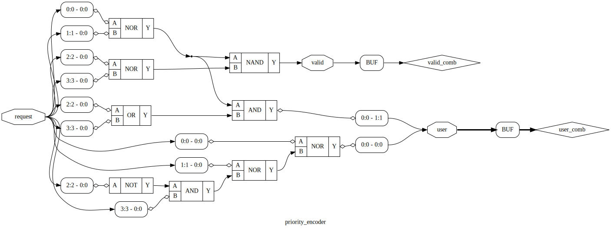

# 无状态仲裁器（优先级编码器）

## 需求

这次，我们需要设计一个仲裁器：假象有多个用户同时要访问同一个资源，但是资源同时只能给一个用户使用，应该怎么实现？这时候，需要使用一个仲裁器，如果同时有多个用户请求访问，选择出一个幸运儿，只有这个幸运儿可以访问资源，其他用户则需要等待。并且假设资源的访问是“立即”完成的，所以不用担心资源正在使用的时候，使用权被其他用户抢走了的问题。

根据上面的需求，假设有四个用户（编号 `0` 到 `3`），可以设计如下的输入输出信号：

输入：

1. `request`: 宽度为 4，每一位 1 表示对应的用户请求访问资源，0 表示不请求

输出：

1. `valid`: 1 表示有用户请求访问资源，0 表示无用户请求访问资源
2. `user`: 宽度为 2，如果有用户请求访问资源时，输出获得资源的用户的编号

## 波形

根据上面的需求，可以发现，当同时有多个用户请求访问资源的时候（也就是 `request` 有不止一个位是 `1`时）答案是不唯一的。我们这里选择一种简单的策略：选择编号最小的那一个，这种方式也叫优先级编码器（priority encoder）。可以得到如下的波形：

<script type="WaveDrom">
{
  signal:
    [
      { name: "request", wave: "=.=.=.=.=.=.", data: ["0b0000", "0b0001", "0b0100", "0b0000", "0b1111", "0b1110"]},
      { name: "valid", wave: "0.1...0.1..."},
      { name: "user", wave: "x.=.=.x.=.=.", data: ["0","2","0","1"]}
    ]
}
</script>

出现多个用户请求访问的时候，也可以选择编号最大的那一个，此时可以得到如下的波形：

<script type="WaveDrom">
{
  signal:
    [
      { name: "request", wave: "=.=.=.=.=.=.", data: ["0b0000", "0b0001", "0b0100", "0b0000", "0b1111", "0b1110"]},
      { name: "valid", wave: "0.1...0.1..."},
      { name: "user", wave: "x.=.=.x.=.=.", data: ["0","2","3","3"]}
    ]
}
</script>

## 电路

首先分析一下，在仲裁器的，输出完全由输入决定，没有内部状态，所以可以用 **组合逻辑** 来实现。

接着思考，`valid` 信号比较简单，只要有一个输入为 `1`，那么就输出 `valid=1`，所以直接把所有输入用或门连接在一起即可。

那么，如何找到请求的用户里，编号最小的那一个呢？我们可以分情况讨论，下面的 `x` 表示任意值：

1. `request=0000`，那么输出的 `user` 可以是任意值，因为此时 `valid=0`
2. `request=xxx1`，此时 `user=0, valid=1`
3. `request=xx10`，此时 `user=1, valid=1`
4. `request=x100`，此时 `user=2, valid=1`
5. `request=1000`，此时 `user=3, valid=1`

可以发现，上面的五个条件 **不全不漏** 地遍历了所有可能的情况。在实现组合逻辑的时候，一定要 **考虑所有情况，并且每个情况下每个信号都要得到一个结果** ，否则电路上是无法构造纯组合逻辑的，不可避免会引入锁存器（latch），这时候逻辑的工作方式可能不符合预期。

把上面的逻辑实现成电路，可以得到如下的电路图：



## 代码

既然电路的实现已经很清晰了，让我们用 HDL 语言来实现上述的功能吧。

=== "VHDL"
    
    首先根据输入输出信号，声明 `entity`：
    
    ```vhdl
    library IEEE;
    use IEEE.STD_LOGIC_1164.ALL;
    use IEEE.STD_LOGIC_ARITH.ALL;
    use IEEE.STD_LOGIC_UNSIGNED.ALL;
    
    entity priority_encoder is
        Port ( request : in  STD_LOGIC_VECTOR (3 downto 0);
               valid   : out STD_LOGIC;
               user    : out STD_LOGIC_VECTOR (1 downto 0));
    end priority_encoder;
    ```
    
    接着来实现主要的逻辑部分。由于这里是纯组合逻辑，所以没有时钟，也不会形如 `clk'event` 或者 `rising_edge(clk)` 的判断。由于这里的输入信号只有 `request`，所以可以把所有组合逻辑放在一个 `process(request)` 块中实现：
    
    ```vhdl
    architecture behavior of priority_encoder is
    begin
      process (request) begin
        -- default
        valid <= '0';
        user <= "00";
    
        -- cases
        if request(0)='1' then
          valid <= '1';
          user <= "00";
        elsif request(1)='1' then
          valid <= '1';
          user <= "01";
        elsif request(2)='1' then
          valid <= '1';
          user <= "10";
        elsif request(3)='1' then
          valid <= '1';
          user <= "11";
        end if;
      end process;
    end behavior;
    ```
    
    可以看到，这里首先设置了一个默认的结果，这样如果下面所有的 `if-elsif` 都不满足，那么输出的就是默认值。由于组合逻辑电路中，不允许出现某个情况下没有取值的情况，所以这里必须人为保证 **所有可能性下，每个组合信号都有取值**。为了达成这个目的，并且防止自己遗忘在某些条件下进行赋值，可以在开头设置一个默认值。
    
=== "Verilog"
    
    首先根据输入输出信号，声明 `module`：
    
    ```verilog
    module priority_encoder (
      input [3:0] request,
      output valid,
      output [1:0] user
    );
      // TODO
    endmodule
    ```
    
    接着来实现组合逻辑电路。一种方法是用之前提到的 `assign` 方法，比如 `assign valid = request[0] || request[1] || request[2] || request[3]` 或者更简洁的 `assign valid = |request`；但是要涉及到更加复杂的组合逻辑的时候，这样写会比较复杂。下面我们使用 `always @ (*)` 块来实现这个功能：
    
    ```verilog
      reg valid_comb;
      reg [1:0] user_comb;
    
      always @ (*) begin
        // default
        valid_comb = 1'b0;
        user_comb = 2'd0;
    
        // cases
        case (request)
          4'bxxx1: begin
            valid_comb = 1'b1;
            user_comb = 2'd0;
          end
          4'bxx10: begin
            valid_comb = 1'b1;
            user_comb = 2'd1;
          end
          4'bx100: begin
            valid_comb = 1'b1;
            user_comb = 2'd2;
          end
          4'b1000: begin
            valid_comb = 1'b1;
            user_comb = 2'd3;
          end
        endcase
    
      end
    
      assign valid = valid_comb;
      assign user = user_comb;
    ```
    
    !!! question "为什么这里要用 `reg`？明明是组合逻辑呀。"
    
        相信第一次看到这段代码的你一定会有这样的疑惑，这其实是 Verilog 语法上的一个特殊要求，所有在 `always` 块中赋值的对象，无论是组合逻辑的 `always @ (*)` 还是时序逻辑的 `always @(posedge clock)`，都需要放在一个 `reg` （或者具有类似语义的类型）中。归根结底是因为 Verilog 描述的是功能模型，它与仿真过程是可以对应的，导致写代码的时候容易混淆。因此，在代码中，我们把这一类 `reg` 的命名都加上了 `_comb` 的后缀表示是组合逻辑。细心的读者也会发现，之前我们所有的寄存器命名都加上了 `_reg` 的后缀，就是为了区分这两种用途。
    
    此时，我们就可以在 `always @ (*)` 块中灵活地使用各种条件语句，包括这里使用的 `case` 语句。可以看到，这里首先设置了一个默认的结果，这样如果下面所有的 `case` 都不满足，那么输出的就是默认值。由于组合逻辑电路中，不允许出现某个情况下没有取值的情况，所以这里必须人为保证 **所有可能性下，每个组合信号都有取值**。为了达成这个目的，并且防止自己遗忘在某些条件下进行赋值，可以在开头设置一个默认值。
    
    !!! question "为什么这里的赋值是 `=`，而之前在 `always @ (posedge clock)` 中用的是 `<=`？"
    
        这依然是 Verilog 的设计问题。具体的原因不详述了，只要记住在时序逻辑 `always @ (posedge clock)` 中始终用 `<=`（非阻塞赋值），而组合逻辑 `always @ (*)` 中始终用 `=`（阻塞赋值）。
    
=== "System Verilog"
    
    首先根据输入输出信号，声明 `module`：
    
    ```verilog
    module priority_encoder (
      input [3:0] request,
      output valid,
      output [1:0] user
    );
      // TODO
    endmodule
    ```
    
    接着来实现组合逻辑电路。一种方法是用之前提到的 `assign` 方法，比如 `assign valid = request[0] || request[1] || request[2] || request[3]` 或者更简洁的 `assign valid = |request`；但是要涉及到更加复杂的组合逻辑的时候，这样写会比较复杂。下面我们使用 `always_comb` 块来实现这个功能：
    
    ```verilog
      reg valid_comb;
      reg [1:0] user_comb;
    
      always_comb begin
        // default
        valid_comb = 1'b0;
        user_comb = 2'd0;
    
        // cases
        case (request)
          4'bxxx1: begin
            valid_comb = 1'b1;
            user_comb = 2'd0;
          end
          4'bxx10: begin
            valid_comb = 1'b1;
            user_comb = 2'd1;
          end
          4'bx100: begin
            valid_comb = 1'b1;
            user_comb = 2'd2;
          end
          4'b1000: begin
            valid_comb = 1'b1;
            user_comb = 2'd3;
          end
        endcase
    
      end
    
      assign valid = valid_comb;
      assign user = user_comb;
    ```
    
    !!! question "为什么这里要用 `reg`？明明是组合逻辑呀。"
    
        相信第一次看到这段代码的你一定会有这样的疑惑，这其实是 Verilog 语法上的一个特殊要求，所有在 `always` 块中赋值的对象，无论是组合逻辑的 `always_comb` 还是时序逻辑的 `always_ff @(posedge clock)`，都需要放在一个 `reg` （或者具有类似语义的类型）中。归根结底是因为 Verilog 描述的是功能模型，它与仿真过程是可以对应的，导致写代码的时候容易混淆。因此，在代码中，我们把这一类 `reg` 的命名都加上了 `_comb` 的后缀表示是组合逻辑。细心的读者也会发现，之前我们所有的寄存器命名都加上了 `_reg` 的后缀，就是为了区分这两种用途。
    
    此时，我们就可以在 `always_comb` 块中灵活地使用各种条件语句，包括这里使用的 `case` 语句。可以看到，这里首先设置了一个默认的结果，这样如果下面所有的 `case` 都不满足，那么输出的就是默认值。由于组合逻辑电路中，不允许出现某个情况下没有取值的情况，所以这里必须人为保证 **所有可能性下，每个组合信号都有取值**。为了达成这个目的，并且防止自己遗忘在某些条件下进行赋值，可以在开头设置一个默认值。
    
    !!! question "为什么这里的赋值是 `=`，而之前在 `always_ff @ (posedge clock)` 中用的是 `<=`？"
    
        这依然是 Verilog 的设计问题。具体的原因不详述了，只要记住在时序逻辑 `always_ff @ (posedge clock)` 中始终用 `<=`（非阻塞赋值），而组合逻辑 `always_comb` 中始终用 `=`（阻塞赋值）。

## 总结

通过这几个例子学习，我们学会了简单的纯组合逻辑电路、复杂的纯组合逻辑电路还有两种逻辑同时使用的电路的设计方法和代码实现。之后的各种电路设计中，除非少数特殊的电路，其他的所有电路都可以用上面提到的方法来实现。如果要总结规律的话，那就是：

1. 确定输入输出
2. 确定需要哪些寄存器
3. 实现时序逻辑，VHDL 中就是 `clock=1 and clock'event`，Verilog 中就是 `always @ (posedge clock)`
4. 实现组合逻辑，VHDL 中就是直接赋值，Verilog 中就是 `assign` 或者 `always @ (*)`