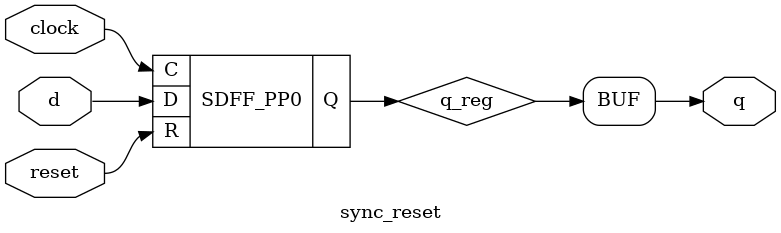
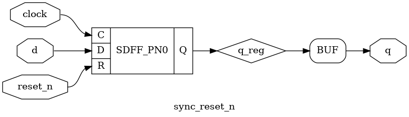
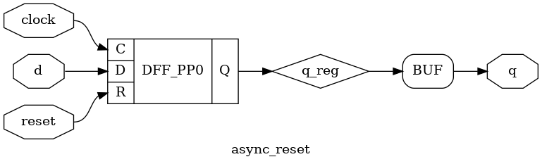
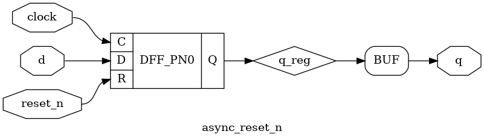

# 秒表

## 需求

让我们来设计一个简单的秒表：输出一个数字，每秒加一；同时有一个复位按钮，按一下就会恢复到零，然后继续每秒加一。

根据上面的需求，可以设计如下的输入输出信号：

输入：

1. `reset`: 1 表示复位按钮被按下，需要清零；0 表示不需要清零
2. `clock`: 频率为 1MHz 的时钟

输出：

1. `timer`: 4 位的数字，表示目前经过的秒数

!!! question "为什么要输入频率为 1MHz 的时钟？"

    为了实现秒表，肯定需要有一个计时的手段，这就需要外部的时钟来帮忙，比如用一个输出 1MHz 频率时钟的晶振，连接到我们的电路的输入 `clock` 中。这样，我们就可以在内部逻辑中，每一次时钟上升沿的时候给计数器加一，当计数器加到 1,000,000 次的时候，可以知道经过了 1s 的时间。

## 波形

我们来分析上面的需求，首先秒表每秒输出都会加一，说明内部需要保存状态，所以我们需要用 **时序逻辑** 来实现这一部分功能。很自然地，我们可以用一个寄存器 `timer_reg` 来保存当前的秒数，然后把寄存器的输出连接到 `timer` 输出上，这样我们只要保证每 1s 中让 `timer_reg` 加一即可。

那么，接下来的第二个问题是，如何实现每 1s 让 `timer_reg` 加一呢？回忆一下，我们上面引入了一个频率为 1MHz 的时钟，也就是说，每 1us 都有一次时钟上升沿，每 1,000,000 次上升沿就是 1s 的时间。为了记忆现在经过了多少次上升沿，这又是一个状态，所以还是 **时序逻辑**，用一个寄存器 `counter_reg` 来保存当前经过了多少次上升沿。

具体实现就是每次上升沿 `counter_reg` 加一，当加到 1,000,000（准确来说是 0 到 999,999）的时候，可以知道经过了 1s 的时间，这时候给 `timer_reg` 加一，同时让 `counter_reg` 恢复到 0，重新计时，这样就实现了秒表的计时功能。

再来考虑需求里面的复位按钮：按下按钮让计时重新开始。这里有两种实现方法：

1. 按下按钮的时候，输出就变成了 0，这个符合输入一变，输出立即跟着变的特点，所以可以用 **组合逻辑** 实现：`timer = reset ? 0 : timer_reg`；同时在时钟上升沿的时候，如果发现 `reset == 1`，就设置 `timer_reg = 0` 和 `counter_reg = 0`，这样松开按钮的时候会从 0 开始计时。
2. 按下按钮的时候，在时钟上升沿进行检测，如果发现 `reset == 1`，就设置 `timer_reg = 0` 和 `counter_reg = 0`，从下一个周期开始，输出的 `timer = timer_reg` 就变成了 0。一个周期只有 1us 的时间，人无法感知。

考虑到 1MHz 太快，不方便画图，下面的波形图假设 1s 是 3 个时钟周期。

如果采用第一种方法，即 `timer = reset ? 0 : timer_reg`，得到的波形如下：

<script type="WaveDrom">
{
  signal:
    [
      { name: "clock", wave: "p...........", node: "........ab...."},
      { name: "reset", wave: "0.......1.0."},
      { name: "counter_reg", wave: "==========.=", data: ["0","1","2","0","1","2","0","1","2","0","1"]},
      { name: "timer_reg", wave: "=..=..=..=..", data: ["0", "1", "2", "0"]},
      { name: "timer", wave: "=..=..=.=...", data: ["0", "1", "2", "0"]}
    ]
}
</script>

从这个图就可以看出组合逻辑与时序逻辑的区别：在 `a` 时刻，当 `reset == 1` 的时候，输出的 `timer` 立即就变成了 `0`，但是 `timer_reg` 和 `counter_reg` 的清零要等到 **下一个时钟上升沿**（`b` 时刻）才能生效。

如果采用第二种方法，即 `timer = timer_reg`，得到的波形如下：

<script type="WaveDrom">
{
  signal:
    [
      { name: "clock", wave: "p...........", node: "........ab...."},
      { name: "reset", wave: "0.......1.0."},
      { name: "counter_reg", wave: "==========.=", data: ["0","1","2","0","1","2","0","1","2","0","1"]},
      { name: "timer_reg", wave: "=..=..=..=..", data: ["0", "1", "2", "0"]},
      { name: "timer", wave: "=..=..=..=..", data: ["0", "1", "2", "0"]}
    ]
}
</script>

请同学对照上面两个波形来理解一下组合逻辑和时序逻辑的区别。


## 电路

接下来考虑一下电路的实现，首先，上面的讨论得出，有两组寄存器 `timer_reg` 和 `counter_reg`，其中 `timer_reg` 是 4 位，和输出 `timer` 一致，不考虑溢出的问题；`counter_reg` 需要从 0 一路计数到 999,999，简单算一下 log2，可以得到需要 20 位。

确定好位数以后，来思考一下电路。首先是 `counter_reg`，它设计的逻辑就是，在每个 `clock` 上升沿进行更新，那么 `counter_reg` 的新值，也就是输入 D 有三种可能：

1. 当 `reset == 1` 的时候，设成 `0`
2. 否则，当 `counter_reg == 999999` 的时候，设成 `0`
3. 否则，设成 `counter_reg + 1`

上面 2 和 3 点提到的 `counter_reg` 实际上就是输出 Q，经过一系列的判断和逻辑，最后连接到了输入 D。

再来考虑一下 `timer_reg`，它的设计逻辑是，在每个 `clock` 的上升沿进行更新，它的新值，也就是输入 D 有三种可能：

1. 当 `reset == 1` 的时候，设成 `0`
2. 否则，当 `counter_reg == 99999` 的时候，设成 `timer_reg + 1`
3. 否则，保持不变

这些“可能”在电路上对应用组合逻辑实现的选择器，即根据条件的成立与否，选择不同的结果。

最后，我们把 `timer_reg` 的输出连接到 `timer` 输出即可。电路图如下：


这里采用的是上面提到的第二种方法，也就是 `timer = timer_reg`；如果要改成第一种方法的 `timer = reset ? 0 : timer_reg`，只需要在输出 `timer` 前面添加一段组合逻辑即可。

## 代码

最后再用 HDL 来实现如上的功能。

=== "VHDL"
    
    首先，还是根据前面确定的输出信号编写 `entity`：
    
    ```vhdl
    library IEEE;
    use IEEE.STD_LOGIC_1164.ALL;
    use IEEE.STD_LOGIC_ARITH.ALL;
    use IEEE.STD_LOGIC_UNSIGNED.ALL;
    
    entity timer is
        Port ( clock : in  STD_LOGIC;
               reset : in  STD_LOGIC;
               timer : out STD_LOGIC_VECTOR (3 downto 0));
    end timer;
    ```
    
    接着，我们把电路实现放在 `architecture` 中。首先，声明我们需要用到的两个寄存器：
    
    ```vhdl
    architecture behavior of timer is
    signal timer_reg : STD_LOGIC_VECTOR (3 downto 0);
    signal counter_reg : STD_LOGIC_VECTOR (19 downto 0);
    begin
      -- sequential
      -- TODO
    
      -- combinatorial
      -- TODO
    end behavior;
    ```
    
    接下来按照上面的思路来实现 `timer_reg` 和 `counter_reg` 的逻辑：
    
    1. 在 `clock` 的上升沿触发
    2. 判断 `reset`
    3. 判断 `counter_reg = 999999`
    
    由于二者的判断是类似的，我们可以直接合并起来写：
    
    ```vhdl
    architecture behavior of timer is
    signal timer_reg : STD_LOGIC_VECTOR (3 downto 0);
    signal counter_reg : STD_LOGIC_VECTOR (19 downto 0);
    begin
      -- sequential
      process(clock, reset)
      begin
        if clock='1' and clock'event then
          if reset='1' then
            timer_reg <= X"0";
            counter_reg <= X"00000";
          else
            if counter_reg=999_999 then
              timer_reg <= timer_reg + 1;
              counter_reg <= X"00000";
            else
              counter_reg <= counter_reg + 1;
            end if;
          end if;
        end if;
      end process;
    
      -- combinatorial
      timer <= timer_reg;
    end behavior;
    ```
    
    在这里，就可以看到比较复杂的 `if-then-else` 逻辑的使用了。在上面的代码中，语义上是 **当 XX 条件发生的时候，向 YY 寄存器写入 ZZ**，实际上的电路则是 `ZZ = XX ? YY : ZZ`，如果所有写入的条件都不满足，则保留原来的状态。所以你会发现 `timer_reg` 在最后一个 `else` 中没有赋值，那么它就会保持不变。可以尝试想象一下，如果你要实现一个综合器，要如何把一系列的 `if-then-else` 语句，翻译成类似 `ZZ = XX ? YY : ZZ` 的电路。
    
    最后再把 `timer_reg` 连接到输出 `timer` 即可。
    
=== "Verilog"
    
    首先，还是根据前面确定的输出信号编写 `module`：
    
    ```verilog
    module timer (
      input wire clock,
      input wire reset,
      output wire [3:0] timer
    );
      // TODO
    endmodule
    ```
    
    接着，我们把电路实现放在 `module` 中。首先，声明我们需要用到的两个寄存器：
    
    ```verilog
      reg [3:0] timer_reg;
      reg [19:0] counter_reg;
    ```
    
    接下来按照上面的思路来实现 `timer_reg` 和 `counter_reg` 的逻辑：
    
    1. 在 `clock` 的上升沿触发
    2. 判断 `reset`
    3. 判断 `counter_reg = 999999`
    
    由于二者的判断是类似的，我们可以直接合并起来写：
    
    ```verilog
      // sequential
      always @ (posedge clock) begin
        if (reset) begin
          timer_reg <= 4'b0;
          counter_reg <= 20'b0;
        end else begin
          if (counter_reg == 20'd999999) begin
            timer_reg <= timer_reg + 4'b1;
            counter_reg <= 20'b0;
          end else begin
            counter_reg <= counter_reg + 20'b1;
          end
        end
      end
    
      // combinatorial
      assign timer = timer_reg;
    ```
    
    在这里，我们再次采用了 `always @ (posedge clock)` 的写法，这意味着内部的逻辑是时序逻辑，触发条件是 `clock` 的上升沿。同时，在 `always` 块内部可以看到比较复杂的 `if-then-else` 逻辑的使用。在上面的代码中，语义上是 **当 XX 条件发生的时候，向 YY 寄存器写入 ZZ**，实际上的电路则是 `ZZ <= XX ? YY : ZZ`，如果所有写入的条件都不满足，则保留原来的状态。所以你会发现 `timer_reg` 在最后一个 `else` 中没有赋值，那么它就会保持不变。可以尝试想象一下，如果你要实现一个综合器，要如何把一系列的 `if-then-else` 语句，翻译成类似 `ZZ <= XX ? YY : ZZ` 的电路。
    
    最后再把 `timer_reg` 连接到输出 `timer` 即可。
    
=== "System Verilog"
    
    首先，还是根据前面确定的输出信号编写 `module`：
    
    ```verilog
    module timer (
      input wire clock,
      input wire reset,
      output wire [3:0] timer
    );
      // TODO
    endmodule
    ```
    
    接着，我们把电路实现放在 `module` 中。首先，声明我们需要用到的两个寄存器：
    
    ```sv
      logic [3:0] timer_reg;
      logic [19:0] counter_reg;
    ```
    
    接下来按照上面的思路来实现 `timer_reg` 和 `counter_reg` 的逻辑：
    
    1. 在 `clock` 的上升沿触发
    2. 判断 `reset`
    3. 判断 `counter_reg = 999999`
    
    由于二者的判断是类似的，我们可以直接合并起来写：
    
    ```sv
      // sequential
      always_ff @ (posedge clock) begin
        if (reset) begin
          timer_reg <= 4'b0;
          counter_reg <= 20'b0;
        end else begin
          if (counter_reg == 20'd999999) begin
            timer_reg <= timer_reg + 4'b1;
            counter_reg <= 20'b0;
          end else begin
            counter_reg <= counter_reg + 20'b1;
          end
        end
      end
    
      // combinatorial
      assign timer = timer_reg;
    ```
    
    在这里，我们再次采用了 `always_ff @ (posedge clock)` 的写法，这意味着内部的逻辑是时序逻辑，触发条件是 `clock` 的上升沿。同时，在 `always_ff` 块内部可以看到比较复杂的 `if-then-else` 逻辑的使用。在上面的代码中，语义上是 **当 XX 条件发生的时候，向 YY 寄存器写入 ZZ**，实际上的电路则是 `ZZ <= XX ? YY : ZZ`，如果所有写入的条件都不满足，则保留原来的状态。所以你会发现 `timer_reg` 在最后一个 `else` 中没有赋值，那么它就会保持不变。可以尝试想象一下，如果你要实现一个综合器，要如何把一系列的 `if-then-else` 语句，翻译成类似 `ZZ <= XX ? YY : ZZ` 的电路。
    
    最后再把 `timer_reg` 连接到输出 `timer` 即可。

## 总结

经过这个例子，我们学会了如何确定哪些东西需要用一个寄存器来保存，并且如何用 `if-then-else` 的方式来方便地更新寄存器的值，而不用手动去写 `ZZ = XX ? YY : ZZ` 的代码，让综合器自动为我们做电路的转换。

## 扩展

### 同步复位与异步复位

如果你看过网上的一些代码，你可能会发现，有的代码对 `reset` 的处理并不同，例如：

=== "VHDL"

    ```vhdl
    if reset='1' then
      -- some simple reset logic
    elsif clock='1' and clock'event then
      -- some logic
    end if;
    ```

=== "Verilog"

    ```verilog
    always @ (posedge clock, posedge reset) begin
      if (reset) begin
        // some simple reset logic
      end else begin
        // some logic
      end
    end
    ```

=== "System Verilog"

    ```sv
    always_ff @ (posedge clock, posedge reset) begin
      if (reset) begin
        // some simple reset logic
      end else begin
        // some logic
      end
    end
    ```

这种写法和之前的区别是 `reset` 的处理不同，使用这种写法时，即使没有时钟上升沿，也可以复位，因此这种写法称为异步复位。而在上面实现的秒表例子采用的是同步复位，即在时钟上升沿的时候检查复位信号。两种写法都是可以的，在目前的学习阶段中，不需要区分二者的区别。如果你编写的硬件逻辑会运行在 Xilinx 的 FPGA 上，那么建议使用同步复位。

!!! attention "复位时寄存器的赋值必须是常量"

    在复位的时候，对寄存器的赋值需要是常量。这是因为，在 FPGA 中，触发器的复位输入仅仅指明了“复位与否”，但没有指定“复位成多少”，因此仅支持复位成常量，这个常量是通过不同类型的触发器实现的，比如复位到零的触发器、复位到一的触发器。如果在复位逻辑中实现了复杂的逻辑，可能会导致 latch 的生成，综合器也会有警告。

### 触发器类型

由于时钟和复位是十分常见的触发器的输入，因此通常使用的触发器在之前提到的输入 D，输入 C，输出 Q 的基础上，还添加了输入 R 用于复位，而根据同步复位和异步复位、复位的极性（高有效、低有效）的不同一共可以分为四类：

同步复位，高有效（SDFF_PP0 = Synchronous D Flip Flop, Positive/rising edge, Positive/active-high reset polarity, Reset to zero）：

| 输入 D | 输入 C      | 输入 R | 输出 Q |
| ----   | ----------- | ------ | ------ |
| d      | 0->1        | 0      | d      |
| x      | 0->1        | 1      | 0      |



同步复位，低有效（SDFF_PN0 = Synchronous D Flip Flop, Positive/rising edge, Negative/active-low reset polarity, Reset to zero）：

| 输入 D | 输入 C      | 输入 R | 输出 Q |
| ----   | ----------- | ------ | ------ |
| d      | 0->1        | 1      | d      |
| x      | 0->1        | 0      | 0      |



异步复位，高有效（DFF_PP0 = Asynchronous D Flip Flop, Positive/rising edge, Positive/active-high reset polarity, Reset to zero）：

| 输入 D | 输入 C      | 输入 R | 输出 Q |
| ----   | ----------- | ------ | ------ |
| d      | 0->1        | 0      | d      |
| x      | x           | 1      | 0      |



异步复位，低有效（DFF_PN0 = Asynchronous D Flip Flop, Positive/rising edge, Negative/active-low reset polarity, Reset to zero）：

| 输入 D | 输入 C      | 输入 R | 输出 Q |
| ----   | ----------- | ------ | ------ |
| d      | 0->1        | 1      | d      |
| x      | x           | 0      | 0      |



Xilinx Vivado 采用了另一种命名方式：

- FDCE: 异步复位到 0
- FDPE: 异步复位到 1
- FDRE: 同步复位到 0
- FDSE: 同步复位到 1