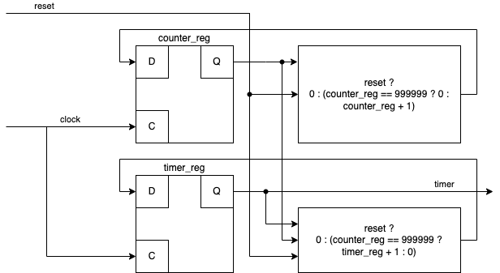

# 秒表

## 需求

让我们来设计一个简单的秒表：输出一个数字，每秒加一；同时有一个复位按钮，按一下就会恢复到零，然后继续每秒加一。

根据上面的需求，可以设计如下的输入输出信号：

输入：

1. `reset`: 1 表示复位按钮被按下，需要清零；0 表示不需要清零
2. `clock`: 频率为 1MHz 的时钟

输出：

1. `timer`: 4 位的数字，表示目前经过的秒数

!!! question "为什么要输入频率为 1MHz 的时钟？"

    为了实现秒表，肯定需要有一个计时的手段，这就需要外部的时钟来帮忙，比如用一个输出 1MHz 频率时钟的晶振，连接到我们的电路的输入 `clock` 中。这样，我们就可以在内部逻辑中，每一次时钟上升沿的时候给计数器加一，当计数器加到 1,000,000 次的时候，可以知道经过了 1s 的时间。

## 波形

我们来分析上面的需求，首先秒表每秒输出都会加一，说明内部需要保存状态，所以我们需要用 **时序逻辑** 来实现这一部分功能。很自然地，我们可以用一个寄存器 `timer_reg` 来保存当前的秒数，然后把寄存器的输出连接到 `timer` 输出上，这样我们只要保证每 1s 中让 `timer_reg` 加一即可。

那么，接下来的第二个问题是，如何实现每 1s 让 `timer_reg` 加一呢？回忆一下，我们上面引入了一个频率为 1MHz 的时钟，也就是说，每 1us 都有一次时钟上升沿，每 1,000,000 次上升沿就是 1s 的时间。为了记忆现在经过了多少次上升沿，这又是一个状态，所以还是 **时序逻辑**，用一个寄存器 `counter_reg` 来保存当前经过了多少次上升沿。

具体实现就是每次上升沿 `counter_reg` 加一，当加到 1,000,000（准确来说是 0 到 999,999）的时候，可以知道经过了 1s 的时间，这时候给 `timer_reg` 加一，同时让 `counter_reg` 恢复到 0，重新计时，这样就实现了秒表的计时功能。

再来考虑需求里面的复位按钮：按下按钮让计时重新开始。这里有两种实现方法：

1. 按下按钮的时候，输出就变成了 0，这个符合输入一变，输出立即跟着变的特点，所以可以用 **组合逻辑** 实现：`timer = reset ? 0 : timer_reg`；同时在时钟上升沿的时候，如果发现 `reset == 1`，就设置 `timer_reg = 0` 和 `counter_reg = 0`，这样松开按钮的时候会从 0 开始计时。
2. 按下按钮的时候，在时钟上升沿进行检测，如果发现 `reset == 1`，就设置 `timer_reg = 0` 和 `counter_reg = 0`，从下一个周期开始，输出的 `timer = timer_reg` 就变成了 0。一个周期只有 1us 的时间，人无法感知。

考虑到 1MHz 太快，不方便画图，下面的波形图假设 1s 是 3 个时钟周期。

如果采用第一种方法，即 `timer = reset ? 0 : timer_reg`，得到的波形如下：

<script type="WaveDrom">
{
  signal:
    [
      { name: "clock", wave: "p...........", node: "........ab...."},
      { name: "reset", wave: "0.......1.0."},
      { name: "counter_reg", wave: "==========.=", data: ["0","1","2","0","1","2","0","1","2","0","1"]},
      { name: "timer_reg", wave: "=..=..=..=..", data: ["0", "1", "2", "0"]},
      { name: "timer", wave: "=..=..=.=...", data: ["0", "1", "2", "0"]}
    ]
}
</script>

从这个图就可以看出组合逻辑与时序逻辑的区别：在 `a` 时刻，当 `reset == 1` 的时候，输出的 `timer` 立即就变成了 `0`，但是 `timer_reg` 和 `counter_reg` 的清零要等到 **下一个时钟上升沿**（`b` 时刻）才能生效。

如果采用第二种方法，即 `timer = timer_reg`，得到的波形如下：

<script type="WaveDrom">
{
  signal:
    [
      { name: "clock", wave: "p...........", node: "........ab...."},
      { name: "reset", wave: "0.......1.0."},
      { name: "counter_reg", wave: "==========.=", data: ["0","1","2","0","1","2","0","1","2","0","1"]},
      { name: "timer_reg", wave: "=..=..=..=..", data: ["0", "1", "2", "0"]},
      { name: "timer", wave: "=..=..=..=..", data: ["0", "1", "2", "0"]}
    ]
}
</script>

请同学对照上面两个波形来理解一下组合逻辑和时序逻辑的区别。


## 电路

接下来考虑一下电路的实现，首先，上面的讨论得出，有两组寄存器 `timer_reg` 和 `counter_reg`，其中 `timer_reg` 是 4 位，和输出 `timer` 一致，不考虑溢出的问题；`counter_reg` 需要从 0 一路计数到 999,999，简单算一下 log2，可以得到需要 20 位。

确定好位数以后，来思考一下电路。首先是 `counter_reg`，它设计的逻辑就是，在每个 `clock` 上升沿进行更新，那么 `counter_reg` 的新的取值，也就是输入 D 有三种可能：

1. 当 `reset == 1` 的时候，设成 `0`
2. 否则，当 `counter_reg == 999999` 的时候，设成 `0`
3. 否则，设成 `counter_reg + 1`

上面 2 和 3 点提到的 `counter_reg` 实际上就是输出 Q，经过一系列的判断和逻辑，最后连接到了输入 D。

再来考虑一下 `timer_reg`，它的设计逻辑是，在每个 `clock` 的上升沿进行更新，它的新的取值，也就是输入 D 有三种可能：

1. 当 `reset == 1` 的时候，设成 `0`
2. 否则，当 `counter_reg == 99999` 的时候，设成 `timer_reg + 1`
3. 否则，保持不变

这些“可能”在电路上对应用组合逻辑实现的选择器，即根据条件的成立与否，选择不同的结果。

最后，我们把 `timer_reg` 的输出连接到 `timer` 输出即可。电路图如下：



这里采用的是上面提到的第二种方法，也就是 `timer = timer_reg`；如果要改成第一种方法的 `timer = reset ? 0 : timer_reg`，只需要在输出 `timer` 前面添加一段组合逻辑即可。

## 代码

最后再用 HDL 来实现如上的功能。

### VHDL

首先，还是根据前面确定的输出信号编写 `entity`：

```vhdl
library IEEE;
use IEEE.STD_LOGIC_1164.ALL;

entity timer is
    Port ( button : in  STD_LOGIC;
           light  : out STD_LOGIC);
end button;
```