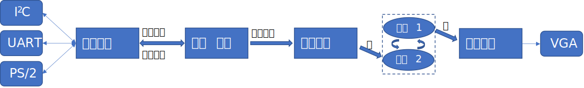
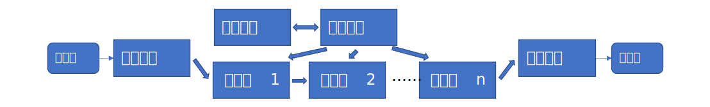

# 项目设计

本页提供了关于项目设计的一些建议和要求。

## 结构划分（中心控制）

本节以最常见的接受外设输入、输出视频的设计为例，说明常见的中心控制模式的模块划分方式。

### 控制逻辑

控制逻辑是设计的核心部分，维护了设计的整体状态，通常由一个到多个状态机构成。它根据用户的输入，计算并更改内部状态。
### 外设控制

此部分与各类外设进行通信（图中的三个协议是常用的例子），向游戏逻辑报告用户输入，并（可能）使用外设进行反馈。
推荐与控制逻辑使用相同的时钟域，仅仅在需要时对外设进行过采样。

### 图形渲染

此部分将内部状态根据需要进行渲染，并写入显存（可以是内部 Block RAM 或者 SRAM / SDRAM）。通常来说渲染可以分成多个阶段或多个层进行，如游戏的渲染可分为背景层、人物层、状态层等，逐层进行覆盖绘制。通常来说，此模块的时钟域也应该与控制逻辑相同，通过显存来隔离不同的时钟。

作为进阶功能，为了防止撕裂和图像抖动，渲染和输出可以使用 **双缓冲**（途中虚线框的部分），即使用两块同样的显存 A 和 B。在渲染模块写入 A 时，另显示模块绘制 B；渲染完成后，立刻交换两块显存，继续下一帧的渲染。这样用户不会看到渲染了一半的状态，显示效果会更好。

!!! warning "必须使用显存"

    画面的渲染必须使用中间存储间接进行， **不能** 直接使用显示输出模块行列值，驱动组合逻辑计算像素颜色，否则将导致时序问题。  
    如果使用单端口片上存储或者片外存储，则需要额外对渲染与显示的读写进行仲裁；如果使用双端口片上存储，则无此问题。

### 显示输出

显示输出模块需要产生 VGA 时序，并根据当前位置从显存中读取数据并输出。显示输出模块的时钟频率应该与 VGA 时序保持一致。

!!! warning "必须遵守时序"

    VGA 时序必须严格遵守，包括时钟频率、行列数量、消隐区的位置和大小，否则可能导致画面输出不正常。  
    必须保证显示模块每个周期都能够读到需要输出的数据，但同时不应该阻塞渲染。一般来说，可以使用较宽的存储，一次读出多个渲染周期需要的数据，避免显示模块持续占用存储，阻塞渲染。

## 结构划分（流水线）

本节说明了使用流水线的项目常见的模块划分方式。通常来说，各种流量处理（如音频、视频、网络）等需要较强的实时性和吞吐量，应该使用流水线的方式设计。

上图中的 **输入解析—流水级 1—流水级 2—$\cdots$—流水级 n—输出生成** 模块组成了一条流水线（pipeline），通过握手信号逐级传递数据。它们应该具有相同的时钟域，每个组件都能独立的处理上游的数据、向下游发送数据。通常来说，流水线的每个阶段（stage）需要能在每个时钟周期内完成一次任务，称为全流水（fully pipelined）；如果流水线阶段出现阻塞（如使用了状态机等非单周期的组件），则将导致流水线的延时增加，吞吐率下降。许多流的处理（如网络转发、音视频处理）由于协议有固定的速率，对流水线的最大延迟有要求，否则就会出现数据丢失。

流水线的结构设计中，同样需要控制逻辑，用于配置每一个流水线阶段的行为。与中心化控制相同的是，控制逻辑也可以通过外设控制模块连接不同的外设，图中略去没有画出。

在较为复杂的设计中，流水线可以与中心控制的模式混合使用，互不影响。

## 提交要求

实验结束后，每组的一位同学提交一份大实验相关材料，形式为包含以下内容的 ZIP 压缩包：

* `design/`：实验完整工程（包括 RTL、Vivado IP、资源文件、testbench 等），请确保 Vivado 打开即可直接编译综合。代码要有必要的注释。为了减小体积，提交时请删除编译的中间文件，使用 git 的同学可借助 `git clean` 命令整理。同时，请保留一份编译后的 bitstream 二进制文件（即 `bit` 文件）。
* `tools/`：实验中涉及的其他工具，如 PC 端 / 单片机软件源码等，或者自行编写的其他工具。最好包含使用方法。
* `doc/`：实验说明文档（即实验报告）和展示 PPT。文档中应该包含整体架构设计、每一部分设计思路等。推荐使用 PDF 格式。如果使用 Markdown 等标记文本格式，请确保引用的图片等都包含于其中。
* `ip/`：可选，如果实验中设计了比较通用的模块（如 FFT 等），可作为 IP 核单独再提取出来。需要包含 RTL 源码和使用说明（比如各个信号的定义），最好有相应的 testbench。
* `README` 文件：包含上面未涉及的，但是需要说明的其他内容，比如 LICENSE 等。
 
!!! note "版权声明"

    默认情况下，视作同学们授权将大作业所有内容分享给以后各届的数设同学用于参考或复用（仅限自主设计的 IP 核）。
    未经额外授权的情况下，课程组不会将同学们的作业用作其他用途。如有异议，可以与助教或者老师提出。
